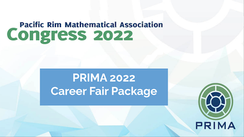

PRIMA is the premier conference in the mathematical sciences representing the
entire Pacific Rim geographic region.  Located in one of Canada’s most beautiful
and vibrant cities, the conference is expected to attract more than 300
professional researchers in the mathematical sciences from around the world,
including students postdoctoral fellows and faculty members at leading academic
institutions.  Many PRIMA participants are students and other early-career
researchers who will be looking for employment now or in the near future.  The
PRIMA Career Fair is a golden opportunity  for job seekers who are highly
skilled in the mathematical sciences to meet with face-to-face with employers
who have opportunities utilizing those skills.  Ultimately, we hope network at
the Career Fair leads to future employees getting started on a satisfying
career.

  

    
  

